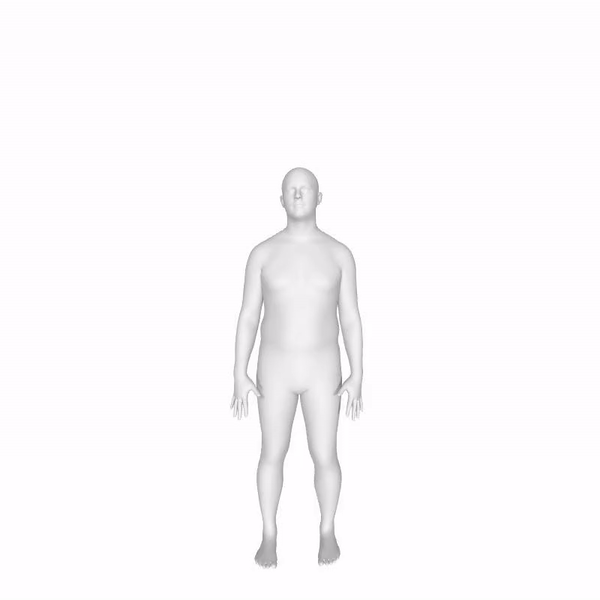
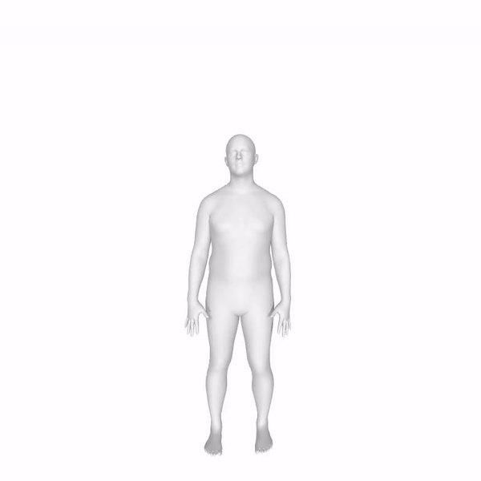

This Repository is contains our project on Computer vision. We are currently trying to get everything on github from google colab. Until we finalize it, refer to the python notebook.

To run the code go to Computer_Vision_Final_Project/Code/Human Pose Prediction.ipynb
Or click on the link below
https://drive.google.com/open?id=1Xp15ns0aZXMhj3gTVF9a4ybZEJ63HCjj

No need to run the Train and Visualize Losses blocks. Run all other blocks.

Once the test block is run completely. You get numpy array saved in the Computer_Vision_Final_Project/new_pred/bhushan_pred/added_l2_loss/c05g01l10/pred_seq_test_ds_s11553_efinal

Using these numpy arrays, we can visualize the SMPL models. But because of a variety of dependencies such as the human body package, we cannot use it on google colab.

To visualize these poses, you can install the following repo.
https://github.com/nghorbani/amass

Following videos show predicted sequence and actual sequence:

Predicted Sequence

Actual Sequence

